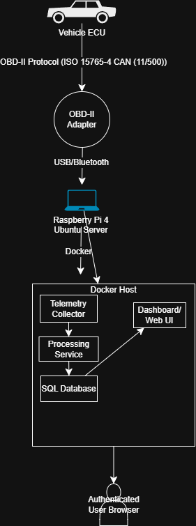
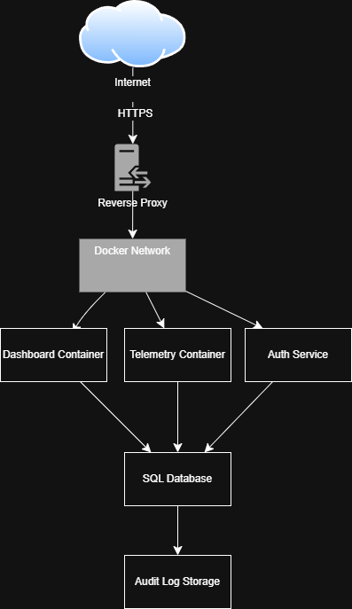
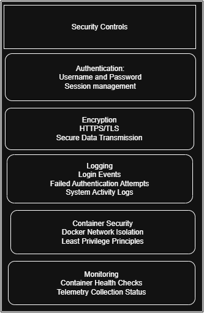

# Secure Connected Car System

## Overview

The Secure Connected Car System is a containerized vehicle telemetry platform designed to simulate real-time automotive data collection, processing, and secure dashboard access.

The project explores how modern vehicles can be monitored using OBD-II data, a Raspberry Pi edge device, and a Docker-based microservice architecture. Security principles such as authentication, network isolation, and audit logging are integrated into the system design.

---

## System Architecture

---

## Network Security Model

---

## Security Controls

---

## How the System Works

1. Vehicle telemetry is collected via OBD-II adapter (planned integration)
2. Raspberry Pi acts as an edge processing device
3. Docker containers handle system services:
   - Telemetry ingestion
   - Data processing
   - Database storage
   - Web dashboard interface
4. Users access the dashboard via a browser
5. Authentication controls system access
6. Audit logging tracks system activity and access events

---

## Technologies

- Docker & Docker Compose
- Python (telemetry simulation in progress)
- Raspberry Pi (planned)
- OBD-II Interface (planned)
- PostgreSQL (planned)
- Git & GitHub

---

## Current Status

This project is in the early development phase.

The current focus is:
- System architecture design
- Security model design
- Documentation
- Preparing a containerized development environment

A telemetry simulation module is currently being developed to generate mock vehicle data for system testing.

---

## Planned Features

- Real-time vehicle telemetry simulation
- Containerized microservices architecture
- Authentication and access control system
- Audit logging and monitoring
- Secure service-to-service communication
- Raspberry Pi deployment
- OBD-II hardware integration
